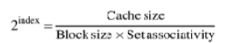

# Описание

## Как определяется размер кэш-линии?:
* Мы проходим по массиву с разными шагами (страйдами)
* При маленьких шагах (1, 2, 4 байта) мы много раз обращаемся к одной кэш-линии
* Когда шаг становится равен размеру кэш-линии, каждое обращение попадает в новую линию и мы получаем прирост по времени

## Как определяется объём кэша?:
* Мы создаем массивы разного размера и измеряем время последовательного доступа
* Пока массив помещается в кэш, время растет линейно
* Когда массив превышает размер кэша, начинаются промахи и время резко возрастает

## Как определяется ассоциативность?:
* Мы создаем несколько массивов и обращаемся к адресам, которые конфликтуют в кэше
* Каждый массив соответствует одному "пути" (way) в кэше
* Когда количество массивов превышает ассоциативность, начинаются вытеснения данных из кэша, что
вызывает резкое увеличение времени доступа

## Как происходит валидация полученных значений?:
По формуле из книги John L. Hennessy & David A. Patterson, appendix B:

